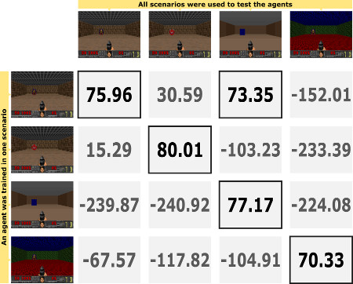

## Investigating Deep Q-Network Agent Sensibility to Texture Changes on FPS Games

**Conference**: [Brazilian Symposium on Computer Games and Digital Entertainment (SBGames)](https://www.sbgames.org/sbgames2020/)


[[Page]](https://paulobruno.github.io/publication/SBGames-investigating-deep/) [[PDF]](https://www.sbgames.org/proceedings2020/ComputacaoFull/209515.pdf)

### Folders

#### Results



**Fixed Maps**: The monster has predefined spawn points shared across all scenarios.  
**Basic**: At every new episode the monster spawns in a random place.


#### Scenarios

**Animated**: custom scenario with animated walls, ceiling, and floor.  
**Basic**: standard *Basic* scenario from [VizDoom](http://vizdoom.cs.put.edu.pl/).  
**Caco**: custom scenario with the original Cacodemon monster skin.  
**Flat**: custom scenario with only flat textures.

#### Training Logs

Full training logs of the agents in all experiments.

### Trained Models

You can find the four trained agents in [this folder](https://drive.google.com/drive/folders/1_AdWODN26PLjq2rpLIlmct55aA1mu2jD?usp=sharing).  
To load a model, extract the files then use the Keras command [load_model](https://www.tensorflow.org/api_docs/python/tf/keras/models/load_model).

### Cite this paper

#### BibTex

```
@InProceedings{serafim2020investigating,
  title = {Investigating Deep Q-Network Agent Sensibility to Texture Changes on {FPS} Games},
  author  = {Serafim, Paulo Bruno Sousa and Nogueira, Yuri Lenon Barbosa and Vidal, Creto Augusto and Cavalcante-Neto, Joaquim Bento and F\'{e}rrer Filho, R\^{o}mulo Freire},
  booktitle = {Proceedings of the XIX Brazilian Symposium on Computer Games and Digital Entertainment (SBGames)},
  pages = {117--125},
  year = {2020},
  issn = {2179-2259},
  doi = {10.1109/SBGames51465.2020.00025}
}
```

